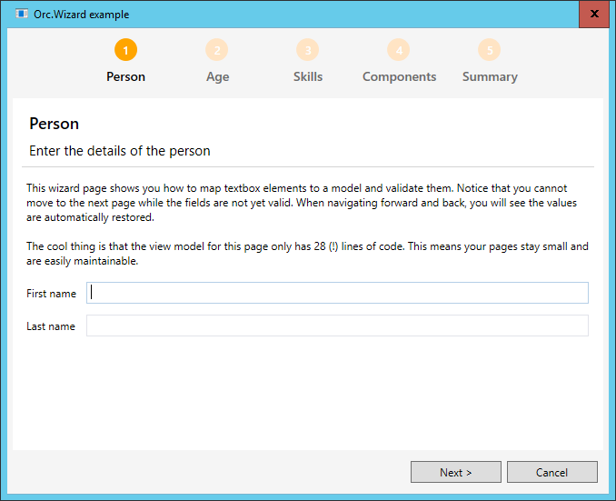
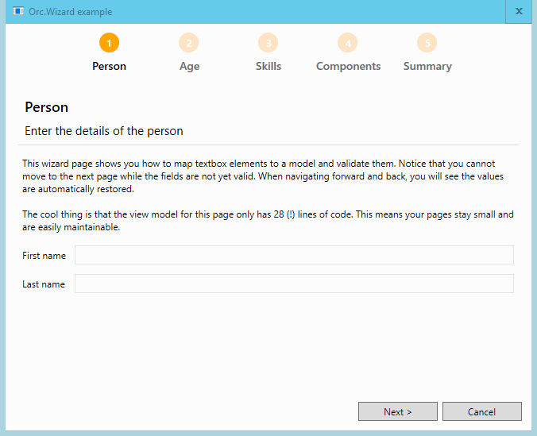

# Orc.Wizard
============

Easily create beautifully looking wizards for WPF using MVVM.

# Quick introduction

A wizard is a great way to guide users through a process. Every wizard should behave the same, but there is no great out-of-the-box experience in WPF. The wizard included in this library has a few nice features:

1. Automatic page management (with everything you expect from next / previous / finish, etc)
2. Automatic (but optional) summary page that gathers all the information from each page to summarize what has been selected inside the wizard
3. Optional pages that allow users to skip to a next page. It is also possible to enforce validation on a wizard page.
4. Nice looking wizard header that is generated automatically based on the accent color  

In summary, this library allows you to focus on the actual wizard content (the pages), not the wizard itself which is fully taken care of for you.

# Creating wizard pages

A wizard page contains of three parts which are explained below.

## Creating the wizard page model

The wizard model will hold all the information of the wizard page and return the summary (which is optional). 

	public class PersonWizardPage : WizardPageBase
	{
	    public PersonWizardPage()
	    {
	        Title = "Person";
	        Description = "Enter the details of the person";
	    }
	
	    public string FirstName { get; set; }
	
	    public string LastName { get; set; }
	
	    public override ISummaryItem GetSummary()
	    {
	        return new SummaryItem
	        {
	            Title = "Person",
	            Summary = string.Format("{0} {1}", FirstName, LastName)
	        };
	    }
	}

## Creating the wizard page view model

The view model is responsible for the actual view logic. There can be a lot of stuff in here that is view-specific, as long as the results are stored into the model. This example uses the `ViewModelToModel` feature of Catel to automatically map the values between the view model and model. As you can see this example even contains validation, so users cannot continue to the next page when the validation does not succeed.

	public class PersonWizardPageViewModel : WizardPageViewModelBase<PersonWizardPage>
	{
	    public PersonWizardPageViewModel(PersonWizardPage wizardPage)
	        : base(wizardPage)
	    {
	    }
	
	    [ViewModelToModel]
	    public string FirstName { get; set; }
	
	    [ViewModelToModel]
	    public string LastName { get; set; }
	
	    protected override void ValidateFields(List<IFieldValidationResult> validationResults)
	    {
	        base.ValidateFields(validationResults);
	
	        if (string.IsNullOrWhiteSpace(FirstName))
	        {
	            validationResults.Add(FieldValidationResult.CreateError("FirstName", "First name is required"));
	        }
	
	        if (string.IsNullOrWhiteSpace(LastName))
	        {
	            validationResults.Add(FieldValidationResult.CreateError("LastName", "Last name is required"));
	        }
	    }
	}

## Creating the wizard page view

Below is the xaml view for the wizard page. Note that it's just an ordinary Catel UserControl.

	<catel:UserControl x:Class="Orc.Wizard.Example.Wizard.Views.PersonWizardPageView"
					   xmlns="http://schemas.microsoft.com/winfx/2006/xaml/presentation"
					   xmlns:x="http://schemas.microsoft.com/winfx/2006/xaml"
					   xmlns:mc="http://schemas.openxmlformats.org/markup-compatibility/2006" 
					   xmlns:d="http://schemas.microsoft.com/expression/blend/2008"
					   xmlns:catel="http://catel.codeplex.com"
					   mc:Ignorable="d" d:DesignHeight="300" d:DesignWidth="300">
	
		<catel:StackGrid>
			<Grid.ColumnDefinitions>
				<ColumnDefinition Width="Auto" />
				<ColumnDefinition Width="*" />
			</Grid.ColumnDefinitions>
			
			<Grid.RowDefinitions>
				<RowDefinition Height="Auto" />
				<RowDefinition Height="Auto" />
				<RowDefinition Height="*" />
			</Grid.RowDefinitions>
	
			<Label Content="First name" />
			<TextBox Text="{Binding FirstName, ValidatesOnDataErrors=True, NotifyOnValidationError=True}" />
			
			<Label Content="Last name" />
			<TextBox Text="{Binding LastName, ValidatesOnDataErrors=True, NotifyOnValidationError=True}" />
			
		</catel:StackGrid>
		
	</catel:UserControl>

# Creating the wizard

Once all the wizard pages have been created, it's time to wrap it inside an actual wizard. Below is an example:

	public class ExampleWizard : WizardBase
	{
	    public ExampleWizard(ITypeFactory typeFactory)
	        : base(typeFactory)
	    {
	        Title = "Orc.Wizard example"; 
	
	        this.AddPage<PersonWizardPage>();
	        this.AddPage<AgeWizardPage>();
	        this.AddPage<SkillsWizardPage>();
	        this.AddPage<ComponentsWizardPage>();
	        this.AddPage<SummaryWizardPage>();
	    }
	}

# Using the wizard

Using the wizard can be done via the `IWizardService`. Below is an example on how to show a wizard:

	await _wizardService.ShowWizardAsync<ExampleWizard>();

# Enjoying the wizard

